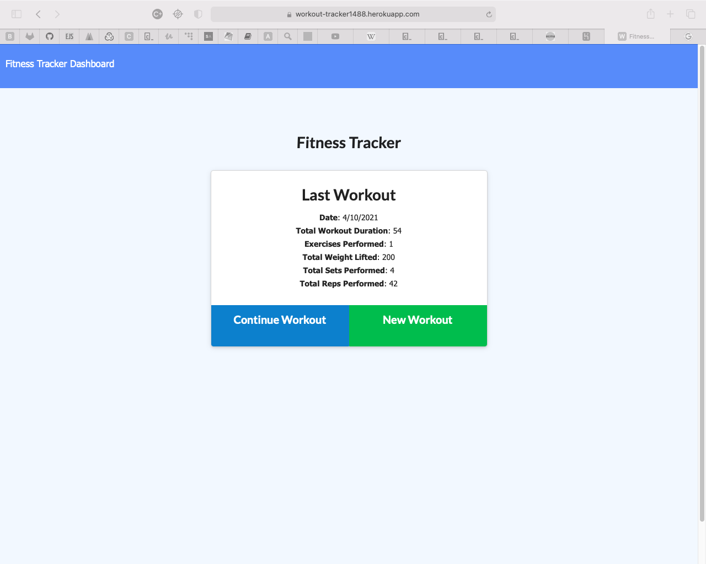

## Workout Tracker

# Description

This application helps to track the workouts that you are doing.

---

# Preview

<!-- ![Link] (https://https://workout-tracker1488.herokuapp.com/?id=6071ac8910d08c0015d91e90) -->

---

## Table of Contents

[Description of Application](#description)

[How to Install](#installation)

[How to Use](#usage)

[License Coverage](#license)

[How to Contribute](#contributing)

[How to Run Tests](#tests)

[Contact Information](#questions)
    
---

# Installation

Fork the repo over, run npm install in IDE of your choice, run node server.js.

---

 # Usage

Use link to go to page and add a new workout, every workout that you see will have data attatched to it in the dashboard tab

---

# License

---

# Contributing

Contact me at jamesgault1488@gmail.com

---

# Questions

jamesgault1488@gmail.com

JJG1488

Contact me via jamesgault1488@gmail.com